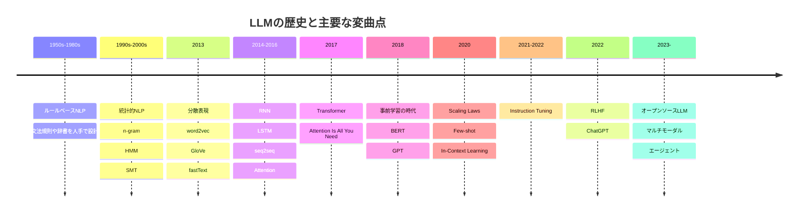
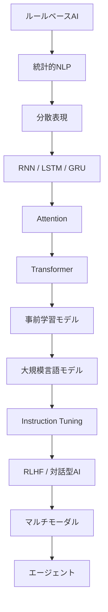
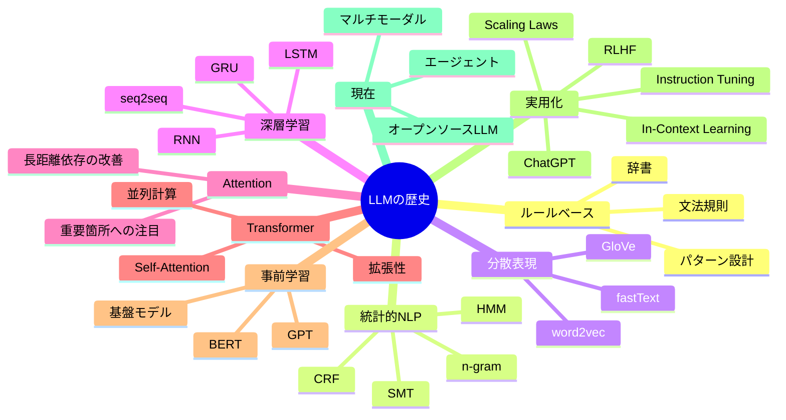
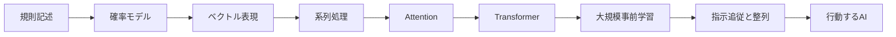

```md
# LLMの歴史と主要な変曲点

このドキュメントは、**GitHub README上でそのまま表示しやすい Mermaid 記法**を意識して整えた版です。  
LLM（大規模言語モデル）の歴史と主要な変曲点を、年表・フローチャート・表で整理します。

---

## 概観

LLMの発展は、おおまかに次の流れで理解できます。

- ルールベースからデータ駆動へ
- 統計モデルから深層学習へ
- RNN中心から Attention / Transformer 中心へ
- タスク特化モデルから汎用基盤モデルへ
- 文章生成器から対話・ツール利用・行動可能なシステムへ

---

## 年表

```text
1950s〜1980s   ルールベースNLP
1990s〜2000s   統計的NLP（n-gram、HMM、SMT）
2013           分散表現（word2vec など）
2014〜2016     RNN / LSTM / seq2seq / Attention
2017           Transformer
2018           BERT / GPT / 事前学習の本格化
2020           Scaling Laws / Few-shot / In-Context Learning
2021〜2022     Instruction Tuning
2022           RLHF / ChatGPT
2023〜         オープンソースLLM / マルチモーダル / エージェント
```

---

## Mermaid タイムライン



---

## Mermaid フローチャート



---

## Mermaid マインドマップ



---

## 技術の流れ



---

## 主要な変曲点

| 時期 | 技術・出来事 | 意義 |
|---|---|---|
| 1990s | 統計的NLP | ルール中心からデータ中心へ移行 |
| 2013 | word2vec | 単語の意味をベクトルとして表現 |
| 2014〜2016 | Attention | 長い文脈の重要箇所を参照可能に |
| 2017 | Transformer | 現代LLMの中核構造を確立 |
| 2018 | BERT / GPT | 事前学習ベースの汎用モデルが主流化 |
| 2020 | Scaling Laws | 大規模化による性能向上が明確化 |
| 2020〜2021 | In-Context Learning | 再学習なしで新タスクに対応 |
| 2021〜2022 | Instruction Tuning | 指示に従うアシスタント型モデルへ進化 |
| 2022 | RLHF / ChatGPT | LLMの大衆化を加速 |
| 2023〜 | マルチモーダル / エージェント | 生成から実行へ拡張 |

---

## ASCII 図

```text
[ルールベースNLP]
        |
        v
[統計的NLP]
        |
        v
[分散表現]
        |
        v
[RNN / LSTM / GRU]
        |
        v
[Attention]
        |
        v
[Transformer]
        |
        v
[BERT / GPT]
        |
        v
[Scaling Laws / In-Context Learning]
        |
        v
[Instruction Tuning / RLHF / ChatGPT]
        |
        v
[マルチモーダル / エージェント]
```

---

## まとめ

LLMの歴史における特に重要な変曲点は、次の5つです。

1. 統計的手法への移行
2. 分散表現の登場
3. Attention と Transformer
4. 事前学習とスケーリング則
5. Instruction Tuning / RLHF / ChatGPT による実用化

現在のLLMは、これらの技術的蓄積の上に成り立っており、今後はさらにマルチモーダル化・ツール利用・エージェント化へ進んでいくと考えられます。
```

추가로 원하시면 제가 바로 해드릴 수 있는 것:
- **GitHub에서 깨질 가능성 낮추도록 더 보수적인 Mermaid만 남긴 최소판**
- **README용 목차(TOC) 포함판**
- **일본어 문체를 더 학술적으로 다듬은 버전**
- **파일명까지 포함한 `README.md` 완성본 형태로 재구성**
